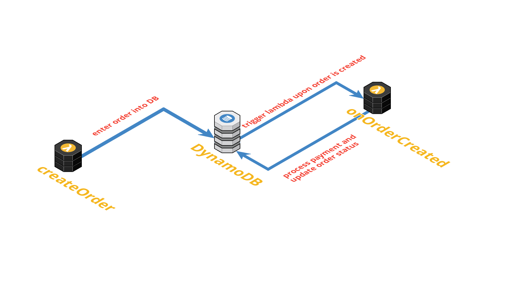

# order-payment
A small serverless project to showcase a simple order to payment workflow using AWS.

It consists of two lambda functions, "createOrder" and "onOrderCreated", and one DynamoDB table, "orders".

"createOrder" is triggered by an API Gateway, it creates an order in DynamoDB table, "orders". A DynamoDB stream has been setup in this table to trigger "onOrderCreated" lambda when a new order is created.

"onOrderCreated" will either confirm or cancel the order based on some dummy random logic, and the status of the order will be updated accordingly.

